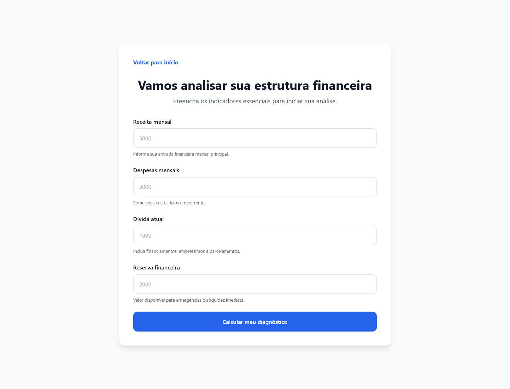
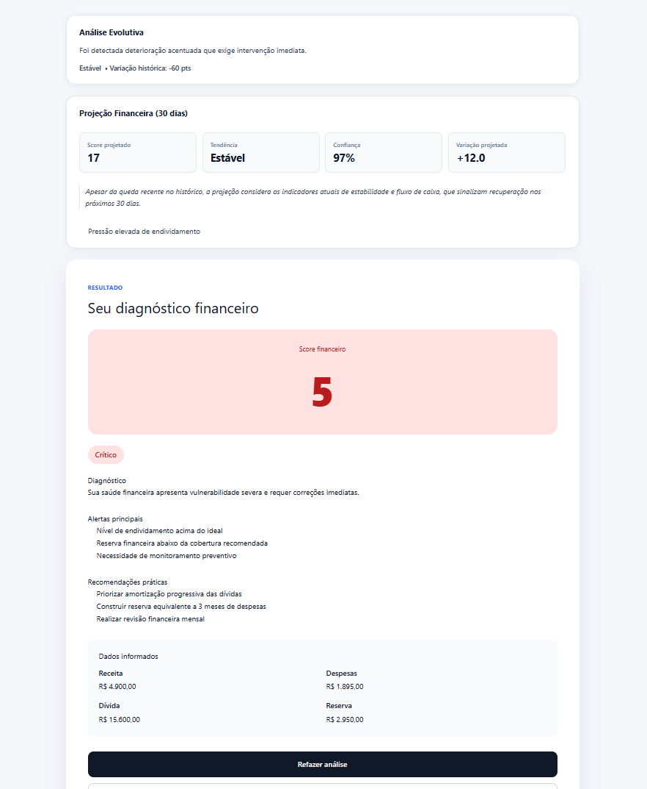
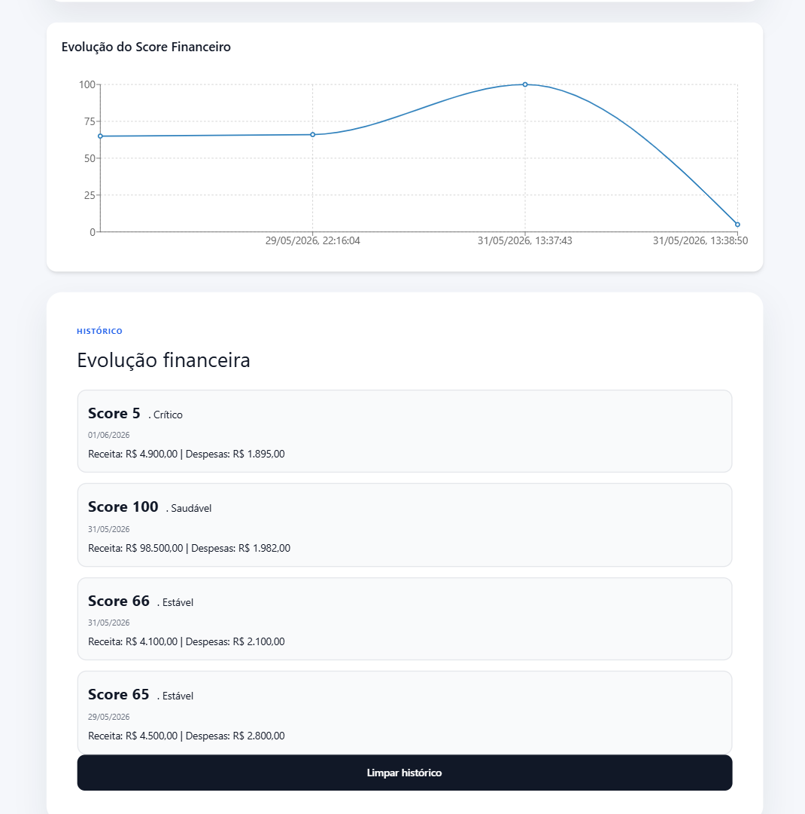

# Financial IA

Plataforma web para diagnóstico financeiro automatizado, criada para transformar informações financeiras simples em score, classificação de risco, recomendações iniciais e leitura evolutiva do histórico do usuário.

**URL pública atual:** <https://financial-ia-sandy.vercel.app>

**Status:** Produção Inicial (Founder Release) - MVP publicado e disponível para testes públicos.

> O endereço `financial-ia.vercel.app` não é a URL pública deste projeto. Para testes e divulgação, use a URL oficial acima.

## Visão Geral

O Financial IA permite que o usuário informe receita, despesas, dívida e reserva financeira para receber uma análise objetiva da sua situação atual. A plataforma também registra o histórico local das análises para exibir evolução do score, tendência, variação histórica e um gráfico interativo.

O produto tem caráter informativo e educacional. Ele apoia a percepção financeira do usuário, mas não substitui orientação financeira profissional.

## Funcionalidades Atuais

- Diagnóstico financeiro automatizado
- Score financeiro de 0 a 100
- Classificação de risco
- Alertas e recomendações iniciais
- Projeção financeira de 30 dias
- Histórico local de análises
- Evolução do score financeiro
- Gráfico interativo do histórico
- Formulário de feedback do usuário
- Página de privacidade e transparência
- Interface responsiva para desktop e mobile
- Health check do backend
- Métricas de aplicação para observabilidade

## Screenshots

### Home


### Diagnóstico







## Arquitetura

```text
Frontend
└─ React + Vite

Backend
└─ FastAPI + Pydantic

Deploy
├─ Vercel (Frontend)
└─ Render (Backend)

Monitoramento
└─ Health check + métricas Prometheus
```

## Stack Técnica

### Frontend

- React
- Vite
- React Router
- Recharts
- Axios
- CSS/Tailwind utilities

### Backend

- Python 3.10
- FastAPI
- Pydantic
- scikit-learn
- Prometheus instrumentation

### Qualidade e Segurança

- pytest
- pytest-cov
- Ruff
- Bandit
- pip-audit
- pip-tools
- GitHub Actions

## Estrutura do Projeto

```text
.
├── frontend/
│   ├── src/
│   │   ├── components/
│   │   ├── features/essential-diagnosis/
│   │   ├── services/
│   │   └── utils/
│   └── vercel.json
├── src/
│   ├── api/
│   ├── app/
│   ├── core/
│   ├── domain/
│   ├── engine/
│   ├── observability/
│   └── services/
├── tests/
├── monitoring/
├── docs/
│   └── screenshots/
├── requirements.lock
├── requirements-dev.lock
└── README.md
```

## Deploy

### Frontend

Publicado na Vercel:

- <https://financial-ia-sandy.vercel.app>

Deploy manual, quando necessário:

```powershell
cd frontend
vercel --prod
```

### Backend

Publicado no Render:

- <https://financial-ia.onrender.com>

Rotas públicas úteis:

- <https://financial-ia.onrender.com/>
- <https://financial-ia.onrender.com/health>
- <https://financial-ia.onrender.com/docs>

## Configuração de Ambiente

Para conectar o frontend ao backend publicado:

```env
VITE_API_URL=https://financial-ia.onrender.com
```

Em desenvolvimento local, se `VITE_API_URL` não estiver definida, o frontend usa:

```text
http://localhost:8000
```

## Execução Local

### Backend

```powershell
python -m venv .venv
.venv\Scripts\Activate.ps1
python -m pip install --upgrade pip setuptools wheel
python -m pip install -r requirements-dev.lock
uvicorn src.api.app:app --reload
```

Backend local:

- <http://localhost:8000>
- <http://localhost:8000/health>
- <http://localhost:8000/docs>
- <http://localhost:8000/metrics>

### Frontend

```powershell
cd frontend
npm install
npm run dev
```

Frontend local:

- <http://localhost:5173>

## Principais Endpoints

```text
GET  /health
GET  /metrics
POST /score
POST /feedback
POST /diagnosis
POST /upload/csv
```

### Exemplo de Payload do Score

```json
{
  "receita": 6500,
  "despesas": 3600,
  "divida": 1200,
  "reserva": 9000,
  "history": []
}
```

### Exemplo de Resposta

```json
{
  "score": 84,
  "classification": "Saudável",
  "diagnosis": "Sua estrutura financeira apresenta bom equilíbrio.",
  "recommendations": [
    "Realizar revisão financeira mensal",
    "Manter reserva de emergência",
    "Acompanhar evolução do score"
  ],
  "prediction": {
    "projected_score_30d": 86,
    "trend": "stable",
    "confidence": 0.92
  }
}
```

## Observabilidade

O projeto inclui rotas e estrutura para leitura operacional:

- `/health` para validação de disponibilidade
- `/metrics` para métricas Prometheus
- `src/api/business_metrics.py` para métricas de negócio
- `src/observability/` para registry e middleware HTTP

Ambiente local com containers:

```powershell
docker-compose up --build
```

Serviços:

- API: <http://localhost:8000/docs>
- Prometheus: <http://localhost:9090>
- Grafana: <http://localhost:3000>

## Qualidade, Testes e Segurança

### Lint

```powershell
python -m ruff check .
```

### Testes com Cobertura

```powershell
python -m pytest --cov=src --cov-report=term-missing
```

### Segurança Estática

```powershell
python -m bandit -r src -ll
```

### Auditoria de Dependências

```powershell
python -m pip_audit -r requirements.lock
python -m pip_audit -r requirements-dev.lock
```

## Privacidade e Transparência

O Financial IA foi desenvolvido com preocupação em transparência e boas práticas de proteção de dados. A plataforma solicita apenas informações necessárias para gerar o diagnóstico financeiro e apresenta uma página dedicada à privacidade.

As informações financeiras usadas no fluxo web são fornecidas manualmente pelo usuário. O histórico exibido na interface é mantido localmente no navegador para apoiar a evolução visual do score.

Esta plataforma possui caráter informativo e educacional e não substitui orientação financeira profissional.

## Roadmap

- [ ] Domínio próprio (`financial-ia.com.br` ou alternativa definitiva)
- [ ] Capturas finais de Resultado e Histórico com gráfico no README
- [ ] Inteligência preditiva ampliada
- [ ] Dashboard analítico avançado
- [ ] Camada Premium
- [ ] Histórico evolutivo ampliado
- [ ] Exportação ou compartilhamento controlado do diagnóstico
- [ ] Painel interno para leitura consolidada de feedbacks

## Valor do Projeto

Financial IA demonstra uma aplicação full stack orientada a produto, com experiência de usuário, backend estruturado, deploy em nuvem, observabilidade, testes, segurança de dependências e uma evolução clara para validação pública.

O MVP já está publicado e pronto para coleta de feedback real de usuários, mantendo uma base técnica preparada para melhorias incrementais.
